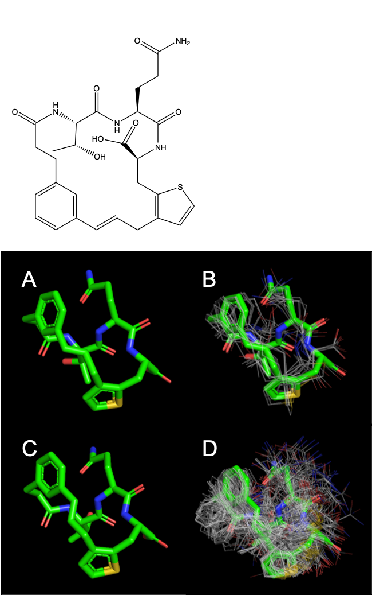
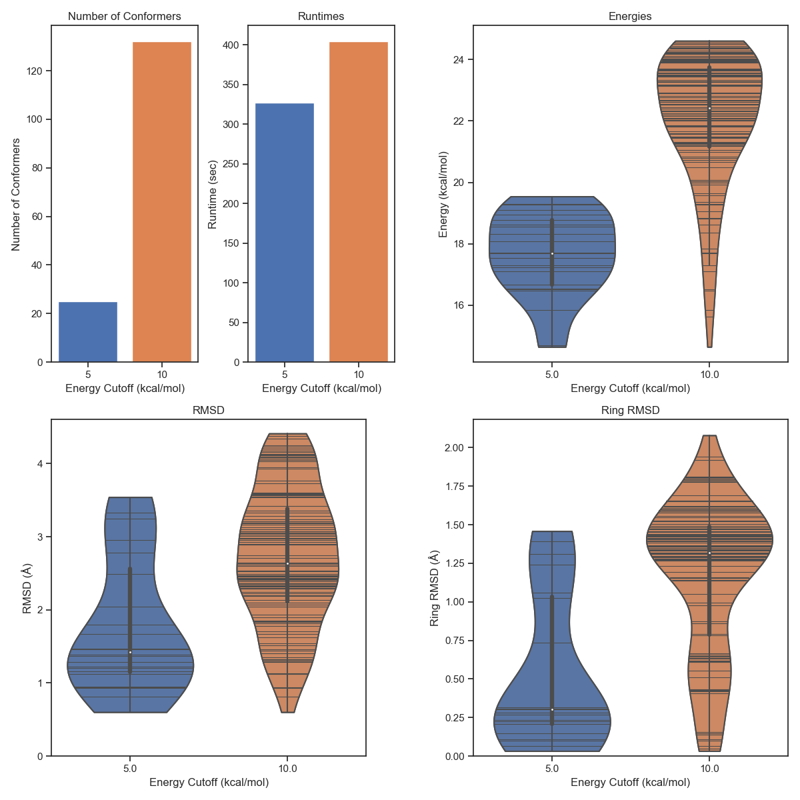
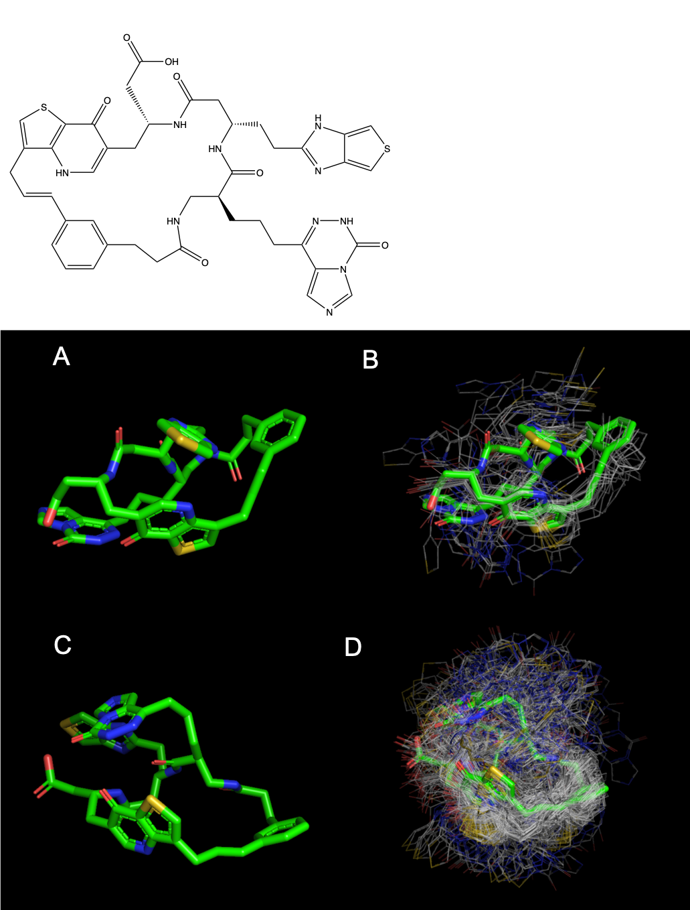
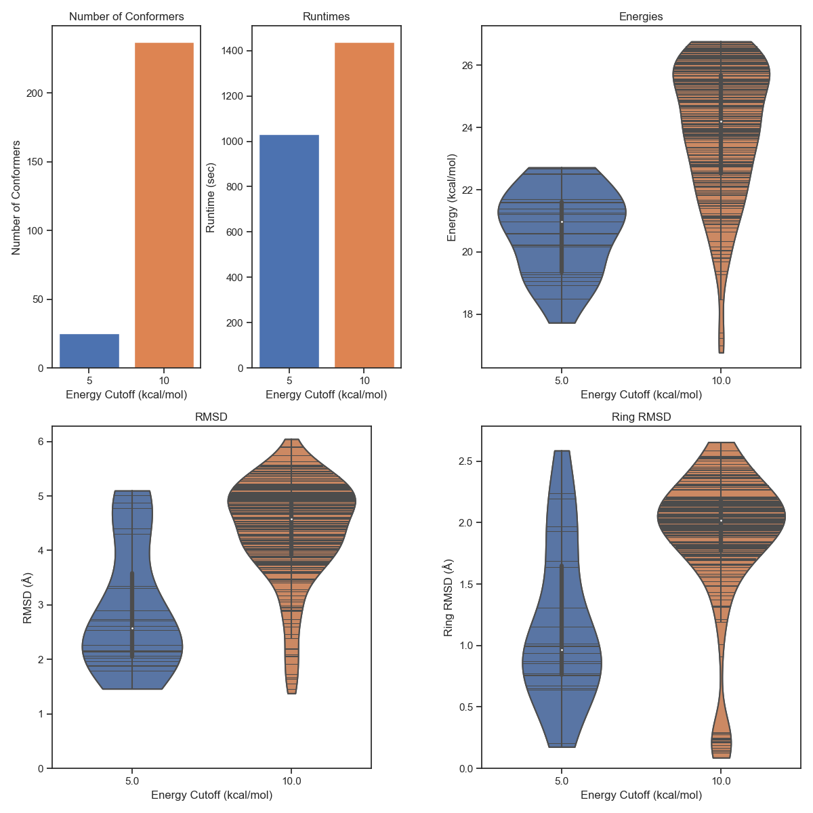
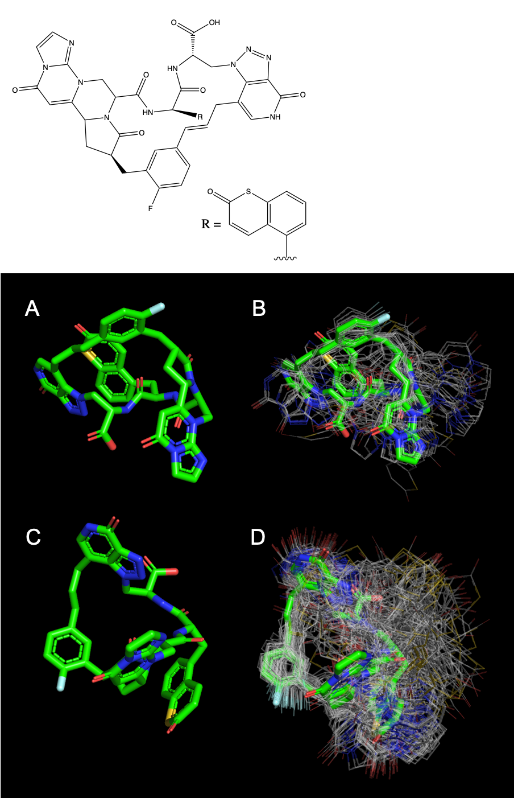
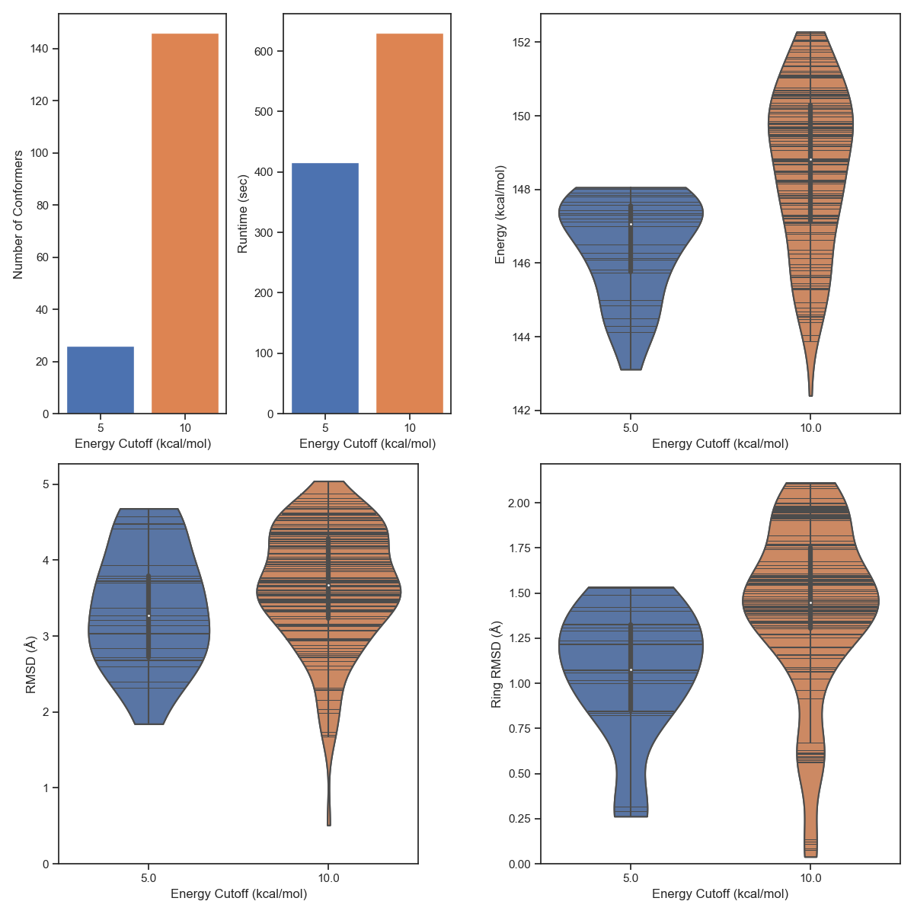

# ConfBuster++

## Info
An RDKit implementation of ConfBuster's<sup>[1]</sup> algorithm for macrocycle conformer generation. This is a
stand-alone version of the conformer generator I implemented in my other [project](https://github.com/e-dang/macrocycles). This software has only been tested on MacOSX.

This tool has only been tested on peptidomimetic macrocycles with one alkene in the macrocycle ring, where the
macrocycle rings have not contained any bridges and were between 10 and 25 atoms large, however, this tool should work for
macrocycles with more than one alkene in the macrocycle ring, and for bridged macrocycles as well.

The source code is contained within the directory __conf_gen__, and conformers for three different macrocycles, along with their associated run statistics are in the __examples__ directory. All three conformers were run twice, first with the energy cutoff at its default value of 10 kcal/mol, and a second time with the energy cutoff set to 5 kcal/mol. The results can be seen below.

Note that within the __conf_gen__ directory there is a __tmp__ directory where files generated during the conformational search process are temporarily stored. These files are cleaned up automatically at the end of the conformational search process or when the program terminates, but if you would like you can change the location of where these files are stored by editing line 41 in __conf_gen.py__.

## Sample Results

In each figure, subfigures A and B are runs performed with an energy cutoff of 5 kcal/mol, where A is the lowest energy conformer, and B is the lowest energy conformer with all other conformers overlayed onto it. Subfigures C and D are runs performed at 10 kcal/mol, where similiarly, C is the lowest energy conformer and D is the lowest energy conformer with all other conformers overlayed onto it.

#### Macrocycle_0
| Number of Rotatable Bonds | Number of Cleavable Bonds | Macro-Ring Size |
| :-----------------------: | :-----------------------: | :-------------: |
|             5             |             9             |       20        |

<div style="text-align:center">   </div>

#### Macrocycle_1
| Number of Rotatable Bonds | Number of Cleavable Bonds | Macro-Ring Size |
| :-----------------------: | :-----------------------: | :-------------: |
|             9             |            11             |       27        |

<div style="text-align:center">   </div>

#### Macrocycle_2
| Number of Rotatable Bonds | Number of Cleavable Bonds | Macro-Ring Size |
| :-----------------------: | :-----------------------: | :-------------: |
|             3             |             7             |       21        |

<div style="text-align:center">   </div>

## Dependencies
- Python3.6.8 or newer
- [RDKit](http://rdkit.org) 2019.03.2<sup>[2]</sup>
- [OpenBabel](http://openbabel.org/wiki/Main_Page) 2.4.1<sup>[3]</sup>

For molecular visualization:
- [Pymol](https://pymol.org/2/)


Optionally, in order to run the __stats.py__ script for generating the graphs above you will need:
- [Matplotlib](https://matplotlib.org/) 3.1.1
- [Pandas](https://pandas.pydata.org/) 0.24.2
- [Seaborn](https://seaborn.pydata.org/) 0.9.0

## Usage
```
python path/to/conf_gen --smiles <SMILES string> -o path/to/output_file.pdb
```

There are also a number of different parameters that may be specified to modify how the conformational sampling process is performed. A full list of options can be seen by typing the command:
```
python path/to/conf_gen --help
```

As an example, this is how you would run the conformational sampling process with an energy cutoff of 5 kcal/mol:
```
python path/to/conf_gen --smiles <SMILES string> -e 5 -o path/to/output_file.pdb
```

## Citations
- [1] Barbeau, Xavier, et al. “ConfBuster: Open-Source Tools for Macrocycle Conformational Search and Analysis.” Journal
of Open Research Software, vol. 6, 2018, doi:10.5334/jors.189.
- [2] Landrum G. RDKit: Open-source cheminformatics.
- [3] Oboyle, Noel M, et al. “Open Babel: An Open Chemical Toolbox.” Journal of Cheminformatics, vol. 3, no. 1, July 2011, doi:10.1186/1758-2946-3-33.