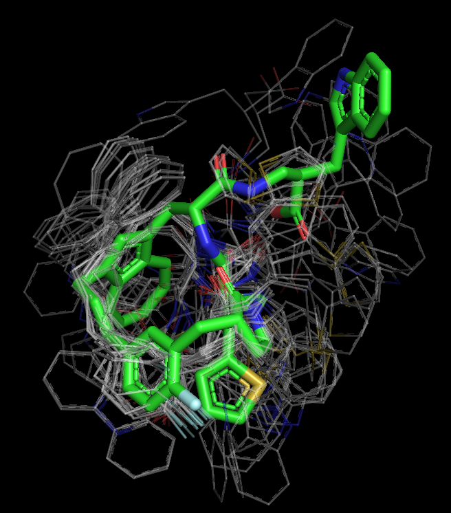

# ConfBuster++

## Info
An RDKit implementation of ConfBuster's<sup>[1]</sup> algorithm for macrocycle conformer generation. This is a stand-alone version of the conformer generator used in [CPMG](https://github.com/e-dang/Composite-Peptide-Macrocycle-Generator.git). This tool has only been tested on macrocycles generated by [CPMG](https://github.com/e-dang/Composite-Peptide-Macrocycle-Generator.git) where the macrocycle ring has one alkene, does not contain any bridges, and are between 10 and 25 atoms large. However, in general, this tool should work for any other type of un-bridge macrocycle.

## Installation
If using MacOS, ConfBuster++ can be downloaded into a conda environment by issuing the command:

```
conda install -c e-dang -c rdkit -c conda-forge confbusterplusplus
```

## Usage
If you have downloaded ConfBuster++ using conda, you can run the program using the command:

```
confbpp <argument list>
```

Otherwise, you can run the program from the top level project directory using the command:

```
python -m confbusterplusplus --smiles <SMILES string> -o path/to/output_file.pdb
```

There are also a number of different parameters that may be specified to modify how the conformational sampling process is performed. A full list of options can be seen by typing the command:

```
confbpp --help
```

or

```
python -m confbusterplusplus --help
```

## Examples
Below are images of the conformers generated by ConfBuster++ and their corresponding 2D structures for two example macrocycles. The lowest energy conformer is in green with all other conformers overlayed in thin, transparent, grey lines. These examples were all ran using the following arguments (as was done in [CPMG](https://github.com/e-dang/Composite-Peptide-Macrocycle-Generator.git)):

```
-r 1 -m 3 -N 5 -n 15 -e 5
```

Using the default parameters of ConfBuster++ results in more conformers on average, but longer runtimes. Corresponding .pdb files and run statistics for each macrocycle can be found in the __examples__ directory. The run statistics include information such as the run times, energies, global RMSDs, ring RMSDs, etc.

---
<p align="center"><b>Macrocycle_0</b></p>

| Run Time (s) | Num Conformers | Number of Rotatable Bonds | Number of Cleavable Bonds | Macro-Ring Size |
| :----------: | :------------: | :-----------------------: | :-----------------------: | :-------------: |
|    120.7     |       11       |             5             |            10             |       23        |

<div style="text-align:center">


</div>

---
<p align="center"><b>Macrocycle_1</b></p>

| Run Time (s) | Num Conformers | Number of Rotatable Bonds | Number of Cleavable Bonds | Macro-Ring Size |
| :----------: | :------------: | :-----------------------: | :-----------------------: | :-------------: |
|    106.8     |       41       |             8             |             6             |       19        |

<div style="text-align:center">


</div>


## Dependencies
- Python 3.6.8
- [RDKit](http://rdkit.org) 2020_03_3
- [OpenBabel](http://openbabel.org/wiki/Main_Page) 3.1.1
- [NumPy](https://numpy.org/) 1.18.1

Optionally, for molecular visualization:
- [Pymol](https://pymol.org/2/)

## Citations
- [1] Barbeau, Xavier, et al. “ConfBuster: Open-Source Tools for Macrocycle Conformational Search and Analysis.” Journal
of Open Research Software, vol. 6, 2018, doi:10.5334/jors.189.

## Contributors
- Eric Dang

